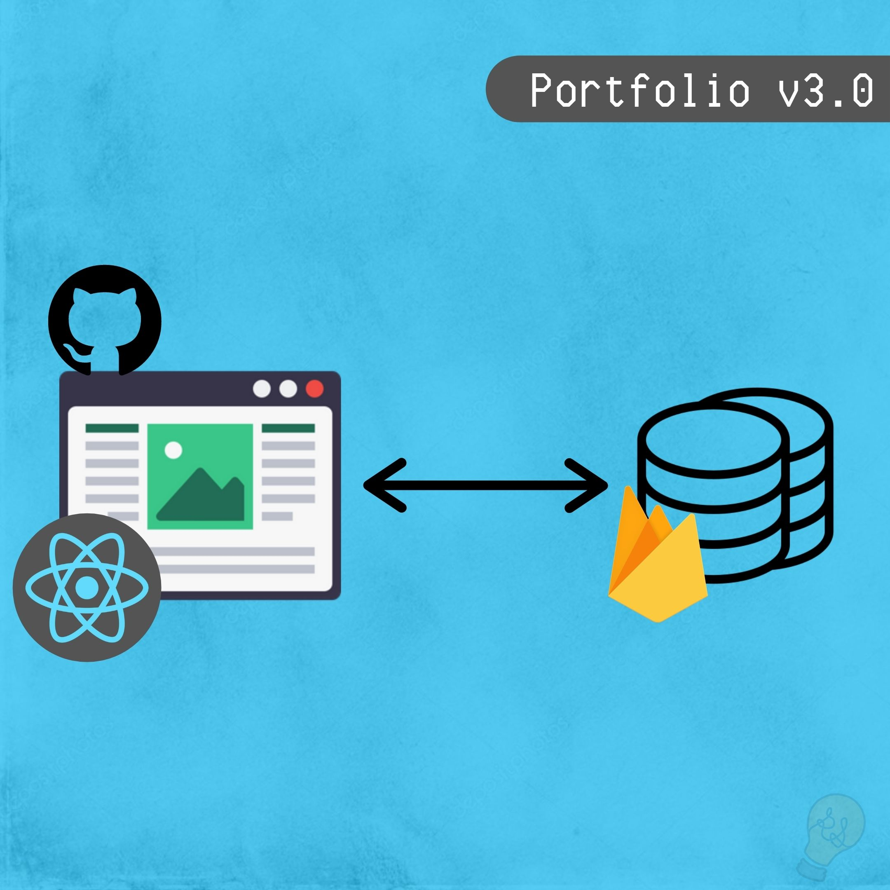
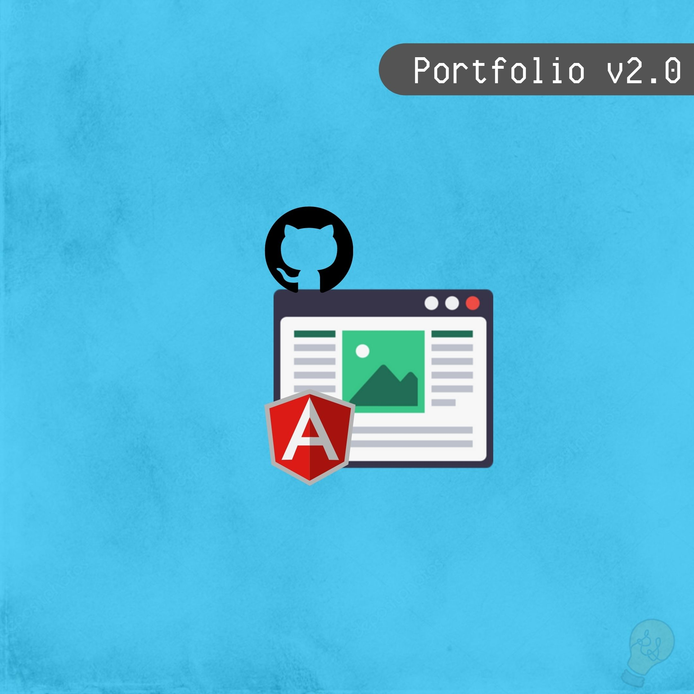
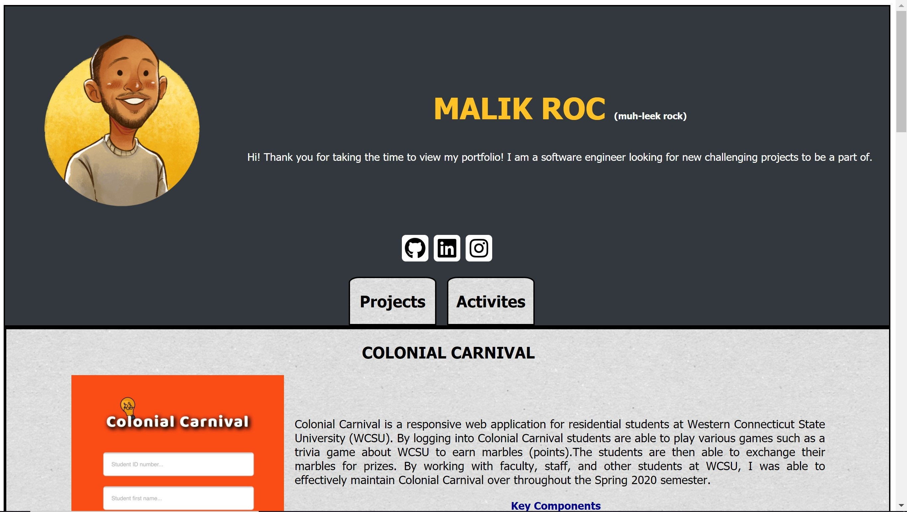
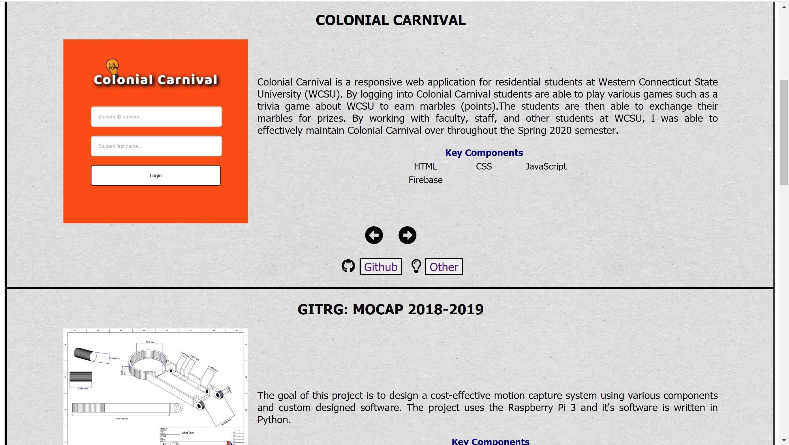
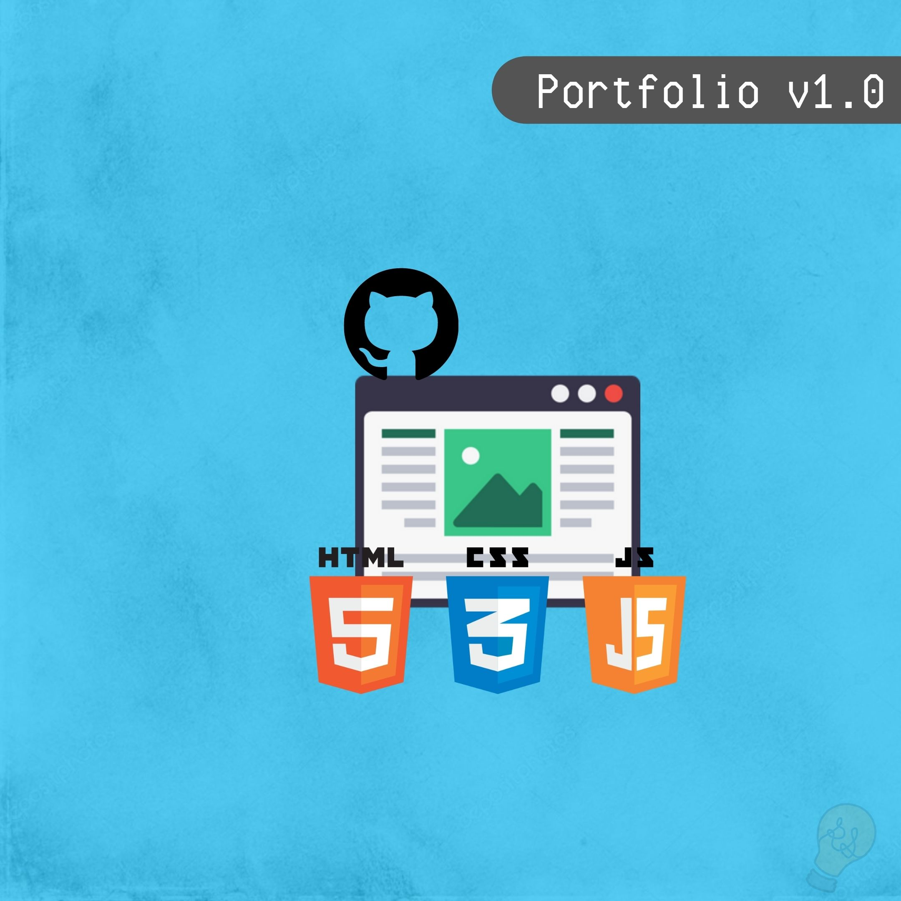
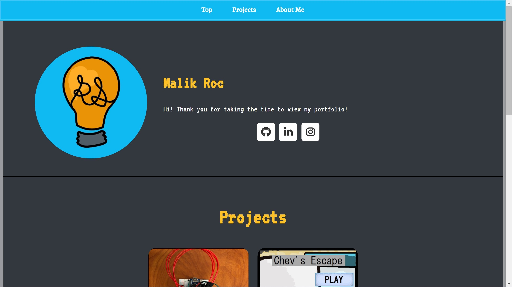

# Roc Portfolio
Roc Portfolio is my online web page showcasing the projects and activities that I have participated in.

## Introduction 
This portfolio was intended to be a project within itself. The intentions is to build and maintain a webpage from the ground up.

## Technologies
- React Library
- Firebase

## Future implementation
- Integrate component animation
- Video demonstration of certain projects
- Normalization of database objects

## Current Bug(s)
- The fav icon does not appear during deployment, however it does during development.

## Reflection
- Developing my portfolio over time has been a great experience. As I learn new technologies and participate in activities I am able to reflect on the portfolio to improve it's quality.

## Versions
### Version 3.0 - React Library
After my recent project, Paw Bytes, I thought it would be a great idea to rebuild my webpage with React. 

### Screenshots

### Version 2.0 - Angular Framework
After understaning HTML, CSS, JavaScript, and JSON I decided to take the next step into learning web development by rebuilding the portfolio using Angular Framework and JSON data file.

#### Screenshots

### Version 1.0 - Vanilla JavaScript
This portfolio was initially designed by using vanilla JavaScript. This project was my introduction to web development.

#### Screenshots

